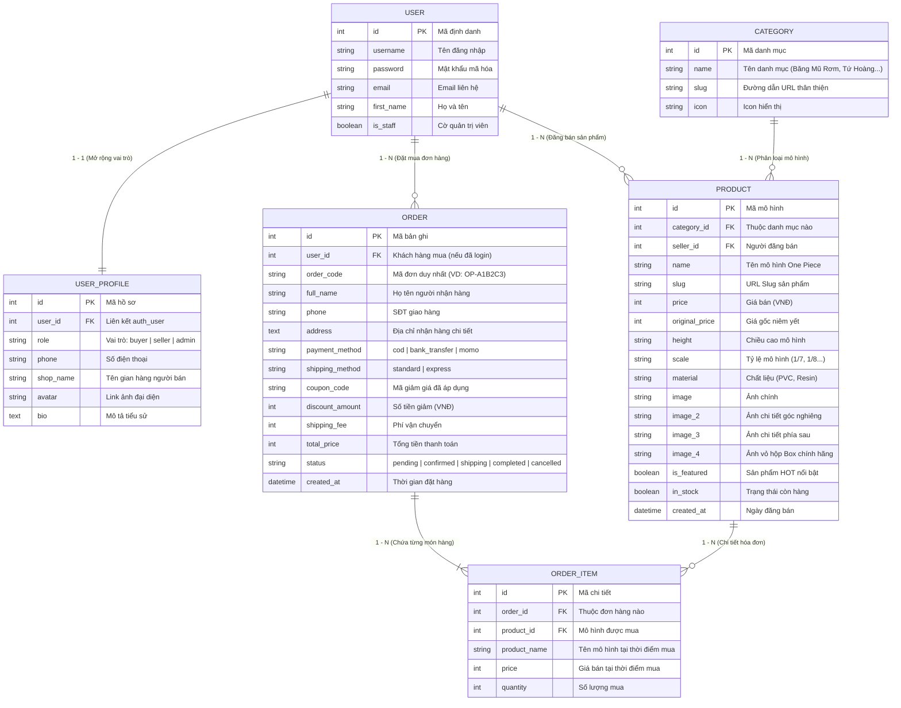
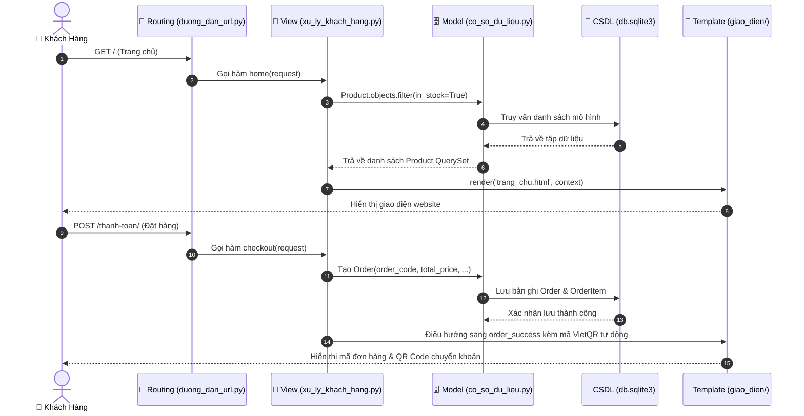

# SYSTEM ARCHITECTURE & DOMAIN-DRIVEN DESIGN (KIẾN TRÚC PHÂN MIỀN)

> **Dự án**: Website Thương Mại Điện Tử Mô Hình One Piece (Django E-Commerce)  
> **Cấu trúc kiến trúc**: Mô hình Phân miền nghiệp vụ (Domain-Driven Architecture) & Django MVT (Model - View - Template)

---

## 1. Sơ Đồ Tổng Thể Phân Miền Hệ Thống (Domain Architecture Diagram)

Sơ đồ dưới đây phân chia cân đối 5 miền chính của toàn bộ dự án từ Frontend, Router, Business Logic, CSDL cho đến Hạ tầng:

```mermaid
graph TB
    %% ==========================================
    %% MIỀN 1: CLIENT & PRESENTATION
    %% ==========================================
    subgraph DOMAIN_CLIENT["🌐 MIỀN 1: GIAO DIỆN & TRÌNH DUYỆT (Client Layer)"]
        direction LR
        U_BUYER["🛒 Khách Mua Hàng<br/>(Guest / Buyer)"]
        U_SELLER["🏪 Chủ Gian Hàng<br/>(Seller Partner)"]
        U_ADMIN["👑 Quản Trị Viên<br/>(System Admin)"]
    end

    %% ==========================================
    %% MIỀN 2: ROUTING & DISPATCHER
    %% ==========================================
    subgraph DOMAIN_ROUTER["🧭 MIỀN 2: ĐIỀU HƯỚNG & PHÂN LUỒNG (Routing Domain)"]
        direction TB
        ROOT_URL["<b>du_an/urls.py</b><br/>(Bộ điều phối URL gốc)"]
        SHOP_URL["<b>cua_hang/duong_dan_url.py</b><br/>(Tuyến đường nghiệp vụ Shop)"]
        ADMIN_URL["<b>/admin/</b><br/>(Django Native Admin)"]
        
        ROOT_URL -->|"path('', include('cua_hang.urls'))"| SHOP_URL
        ROOT_URL -->|"path('admin/', admin.site.urls)"| ADMIN_URL
    end

    %% ==========================================
    %% MIỀN 3: BUSINESS LOGIC - 4 MIỀN CHỨC NĂNG CÂN ĐỐI
    %% ==========================================
    subgraph DOMAIN_LOGIC["🧠 MIỀN 3: XỬ LÝ NGHIỆP VỤ (Business Logic Views Domain)"]
        direction TB

        subgraph SUB_BUYER["🛍️ Phân Miền Khách Hàng<br/><b>cua_hang/xu_ly_khach_hang.py</b>"]
            direction TB
            F_HOME["home()<br/>Xem & Lọc sản phẩm"]
            F_DETAIL["product_detail()<br/>Chi tiết & Ảnh 4 góc"]
            F_CART["cart_view() & add_to_cart()<br/>Giỏ hàng & Coupon"]
            F_CHECKOUT["checkout() & order_success()<br/>Thanh toán & Mã VietQR"]
        end

        subgraph SUB_AUTH["👤 Phân Miền Tài Khoản<br/><b>cua_hang/xu_ly_tai_khoan.py</b>"]
            direction TB
            F_LOGIN["customer_login()<br/>Đăng nhập theo vai trò"]
            F_REGISTER["customer_register()<br/>Đăng ký Người mua/bán"]
            F_PROFILE["customer_profile()<br/>Hồ sơ & Lịch sử đơn"]
            F_LOGOUT["customer_logout()<br/>Đăng xuất an toàn"]
        end

        subgraph SUB_SELLER["🏪 Phân Miền Người Bán<br/><b>cua_hang/xu_ly_nguoi_ban.py</b>"]
            direction TB
            S_DASH["seller_dashboard()<br/>Thống kê doanh thu shop"]
            S_PROD["seller_products() / add / edit<br/>Quản lý kho mô hình"]
            S_ORDER["seller_orders()<br/>Xử lý đóng gói đơn hàng"]
        end

        subgraph SUB_ADMIN["👑 Phân Miền Quản Trị<br/><b>cua_hang/xu_ly_quan_tri.py</b>"]
            direction TB
            A_DASH["admin_portal_dashboard()<br/>Báo cáo toàn sàn"]
            A_USER["admin_portal_users()<br/>Phân quyền Buyer/Seller/Admin"]
            A_PROD["admin_portal_products()<br/>Kiểm duyệt & Ghim HOT"]
            A_ORDER["admin_portal_orders()<br/>Quản lý trạng thái đơn toàn quốc"]
        end
    end

    %% ==========================================
    %% MIỀN 4: DATABASE & ORM
    %% ==========================================
    subgraph DOMAIN_DB["🗄️ MIỀN 4: CƠ SỞ DỮ LIỆU & ORM (Database Domain)"]
        direction TB
        M_CORE["<b>cua_hang/co_so_du_lieu.py</b><br/>(Định nghĩa toàn bộ Model CSDL)"]
        
        subgraph TABLES["CÁC BẢNG DỮ LIỆU CỐT LÕI"]
            direction LR
            T_USER["<b>auth_user & UserProfile</b><br/>Tài khoản & Vai trò"]
            T_CAT["<b>Category</b><br/>Danh mục mô hình"]
            T_PROD["<b>Product</b><br/>Sản phẩm & 4 góc ảnh"]
            T_ORD["<b>Order & OrderItem</b><br/>Đơn hàng & Chi tiết giỏ"]
        end
        
        DB_SQLITE[("<b>db.sqlite3</b><br/>(SQLite Database)")]
        M_CORE --> TABLES
        TABLES --> DB_SQLITE
    end

    %% ==========================================
    %% MIỀN 5: DEVOPS & INFRASTRUCTURE
    %% ==========================================
    subgraph DOMAIN_INFRA["⚙️ MIỀN 5: VẬN HÀNH & NẠP DỮ LIỆU (DevOps & Seed Domain)"]
        direction TB
        SCRIPT_SEED["<b>seed_data.py</b><br/>Nạp 14 mô hình mẫu & 3 tài khoản"]
        DOCKER["<b>Dockerfile</b><br/>Đóng gói container"]
        RENDER["<b>render.yaml & Procfile</b><br/>Triển khai máy chủ đám mây"]
    end

    %% KẾT NỐI LUỒNG TỔNG QUAN
    U_BUYER -->|"Yêu cầu trang mua hàng"| ROOT_URL
    U_SELLER -->|"Truy cập kênh người bán"| ROOT_URL
    U_ADMIN -->|"Vào bảng điều khiển quản trị"| ROOT_URL

    SHOP_URL --> SUB_BUYER
    SHOP_URL --> SUB_AUTH
    SHOP_URL --> SUB_SELLER
    SHOP_URL --> SUB_ADMIN

    SUB_BUYER -->|"Đọc / Ghi đơn"| M_CORE
    SUB_AUTH -->|"Xác thực & Lưu hồ sơ"| M_CORE
    SUB_SELLER -->|"Thêm / Sửa sản phẩm"| M_CORE
    SUB_ADMIN -->|"Kiểm duyệt dữ liệu"| M_CORE

    SCRIPT_SEED -->|"Nạp dữ liệu ban đầu"| M_CORE
    DOCKER -.->|"Chạy ứng dụng"| ROOT_URL
```

---

## 2. Phân Tích Chi Tiết Từng Miền (Domain Matrix)

| Miền Nghiệp Vụ | File Xử Lý Cốt Lõi | Các Hàm Xử Lý Chính | Bảng CSDL Liên Quan | Giao Diện HTML Tương Ứng |
| :--- | :--- | :--- | :--- | :--- |
| **1. Khách Hàng (Customer Domain)** | `cua_hang/xu_ly_khach_hang.py` | `home`, `product_detail`, `cart_view`, `add_to_cart`, `checkout`, `order_success` | `Category`, `Product`, `Order`, `OrderItem` | `trang_chu.html` `chi_tiet_san_pham.html` `gio_hang.html` `thanh_toan.html` `dat_hang_thanh_cong.html` |
| **2. Tài Khoản & Phân Quyền (Auth Domain)** | `cua_hang/xu_ly_tai_khoan.py` | `customer_login`, `customer_register`, `customer_logout`, `customer_profile` | `User`, `UserProfile` (vai trò: buyer, seller, admin) | `dang_nhap.html` `dang_ky.html` `ho_so_ca_nhan.html` |
| **3. Người Bán (Seller Domain)** | `cua_hang/xu_ly_nguoi_ban.py` | `seller_dashboard`, `seller_products`, `seller_product_add`, `seller_orders` | `Product` (lọc theo seller), `Order` | `nguoi_ban/bieu_mau_san_pham.html` `nguoi_ban/danh_sach_don_hang.html` |
| **4. Quản Trị Web (Admin Domain)** | `cua_hang/xu_ly_quan_tri.py` `cua_hang/admin.py` | `admin_portal_dashboard`, `admin_portal_orders`, `admin_portal_users`, `admin_portal_products` | Toàn quyền kiểm soát tất cả các bảng CSDL | `quan_tri/` (Dashboard, Users, Products, Orders) `admin/index.html` |
| **5. Cơ Sở Dữ Liệu (Database Domain)** | `cua_hang/co_so_du_lieu.py` `cua_hang/models.py` | ORM QuerySets, Signals tự động tạo UserProfile, quan hệ Foreign Keys | `UserProfile`, `Category`, `Product`, `Order`, `OrderItem` | N/A (ORM Backend) |
| **6. Điều Hướng (Routing Domain)** | `du_an/urls.py` `cua_hang/duong_dan_url.py` | Phân giải URL, bảo vệ quyền truy cập theo vai trò | Toàn bộ URL endpoints | N/A (Router) |
| **7. Vận Hành & DevOps (Ops Domain)** | `seed_data.py` `Dockerfile` `render.yaml` | Tự động hóa nạp dữ liệu One Piece và triển khai cloud | Nạp sẵn 14 mô hình mẫu, 3 tài khoản mẫu | N/A (CLI / Cloud) |

---

## 3. Sơ Đồ Cơ Sở Dữ Liệu Thực Thể (ERD - Database Relationships)

Sơ đồ liên kết thực thể (ERD) thể hiện đầy đủ các trường, khóa chính (PK), khóa ngoại (FK) và mối quan hệ giữa 5 bảng:

---

## 4. Luồng Dữ Liệu Tương Tác Giữa Các Miền (Data Flow Sequence)

