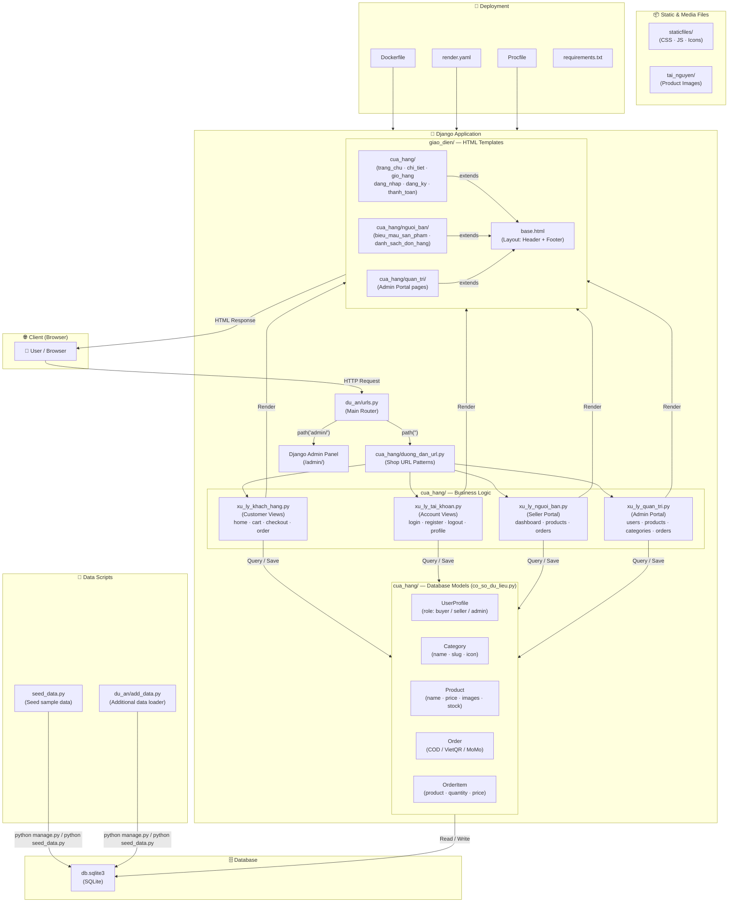
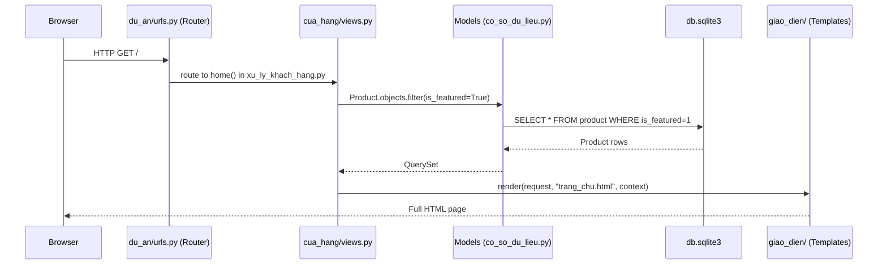
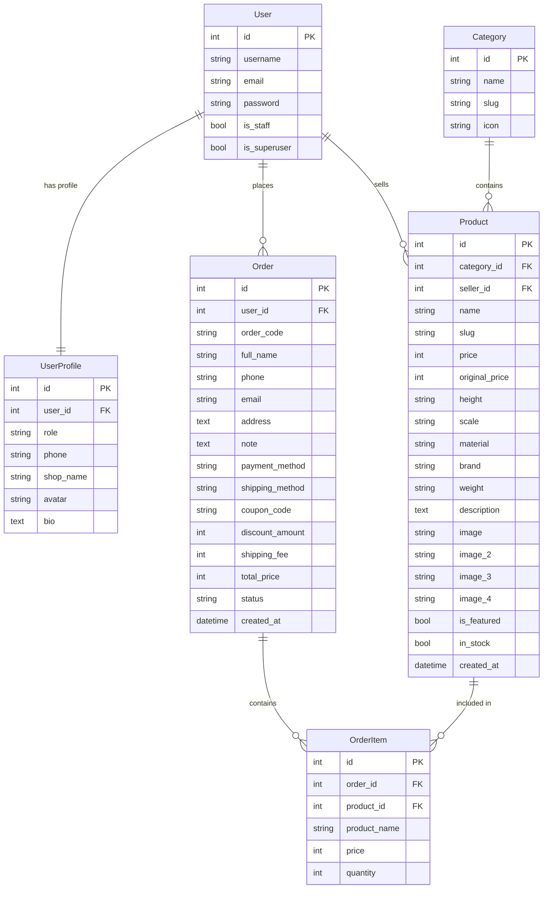
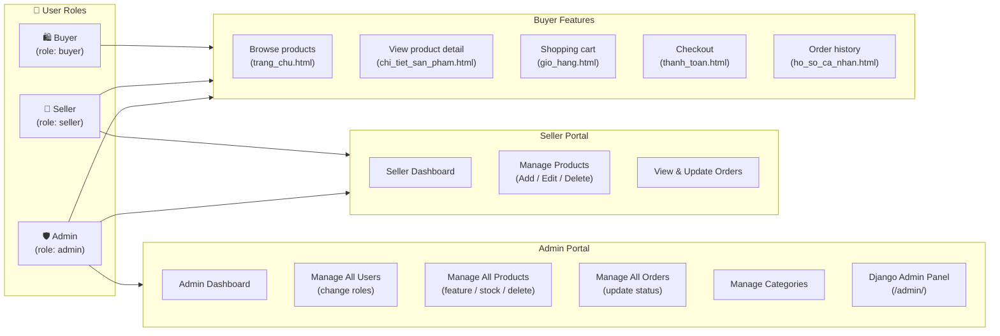

# One Piece Store — Django E-Commerce

> A full-featured e-commerce website for One Piece figure collectibles, built with **Python / Django**.  
> Supports 3 user roles: **Buyer** (customer), **Seller** (shop owner), and **Admin** (site administrator).

---

## System Architecture



---

## Data Flow (Request → Response)



---

## Database Schema (ER Diagram)



---

## User Roles & Permissions



---

## Project Structure

```
One-Piece-Store/
├── du_an/                        # Django project config
│   ├── settings.py               # Database, static files, security settings
│   ├── urls.py                   # Main URL router
│   ├── wsgi.py / asgi.py         # Web server interface
│   └── add_data.py               # Additional data loader script
│
├── cua_hang/                     # Main Django app — all business logic
│   ├── co_so_du_lieu.py          # ★ Database models (UserProfile, Category, Product, Order, OrderItem)
│   ├── models.py                 # Re-exports from co_so_du_lieu.py
│   ├── duong_dan_url.py          # ★ All URL patterns for the shop
│   ├── urls.py                   # Re-exports from duong_dan_url.py
│   ├── xu_ly_khach_hang.py       # Customer views (home, cart, checkout, orders)
│   ├── xu_ly_tai_khoan.py        # Account views (login, register, logout, profile)
│   ├── xu_ly_nguoi_ban.py        # Seller portal views
│   ├── xu_ly_quan_tri.py         # Admin portal views
│   ├── context_processors.py     # Global template context (cart count, etc.)
│   ├── du_lieu_dung_chung.py     # Shared data utilities
│   ├── admin.py                  # Django admin registration
│   └── migrations/               # Database migration files
│
├── giao_dien/                    # HTML Templates (Frontend)
│   ├── base.html                 # Base layout (Header + Footer)
│   ├── cua_hang/                 # Customer-facing pages
│   │   ├── trang_chu.html        # Homepage
│   │   ├── chi_tiet_san_pham.html# Product detail page
│   │   ├── gio_hang.html         # Shopping cart
│   │   ├── thanh_toan.html       # Checkout
│   │   ├── dat_hang_thanh_cong.html # Order success
│   │   ├── dang_nhap.html        # Login page
│   │   ├── dang_ky.html          # Register page
│   │   ├── ho_so_ca_nhan.html    # User profile & order history
│   │   ├── nguoi_ban/            # Seller portal pages
│   │   └── quan_tri/             # Admin portal pages
│   └── admin/                   # Custom Django admin templates
│
├── staticfiles/                  # Collected static files (CSS, JS, icons)
├── tai_nguyen/                   # Media/resource files (product images)
├── seed_data.py                  # Script to seed sample data into DB
├── db.sqlite3                    # SQLite database file
├── manage.py                     # Django management CLI
├── requirements.txt              # Python dependencies
├── Dockerfile                    # Docker container config
├── render.yaml                   # Render.com deployment config
└── Procfile                      # Process config for Heroku / Render
```

---

## Setup & Run Locally

```bash
# 1. Clone the repository
git clone <repo-url>
cd One-Piece-Store

# 2. Create and activate virtual environment
python -m venv venv
venv\Scripts\activate        # Windows
# source venv/bin/activate   # macOS / Linux

# 3. Install dependencies
pip install -r requirements.txt

# 4. Apply database migrations
python manage.py migrate

# 5. Seed sample data
python seed_data.py

# 6. Create superuser (Admin)
python manage.py createsuperuser

# 7. Run development server
python manage.py runserver
# Visit: http://127.0.0.1:8000
```

## Deployment

| File | Purpose |
|------|---------|
| `Dockerfile` | Containerize the app with Docker |
| `render.yaml` | One-click deploy to [Render.com](https://render.com) |
| `Procfile` | Process definition for Heroku / Render |
| `requirements.txt` | Python package list |

## Tech Stack

| Layer | Technology |
|-------|-----------|
| Backend | Python 3 + Django 5 |
| Database | SQLite (dev) / PostgreSQL (prod) |
| Frontend | HTML5 + CSS3 + Bootstrap |
| Static Files | WhiteNoise |
| Deployment | Docker / Render.com |
| Payment | COD · VietQR Bank Transfer · MoMo |
